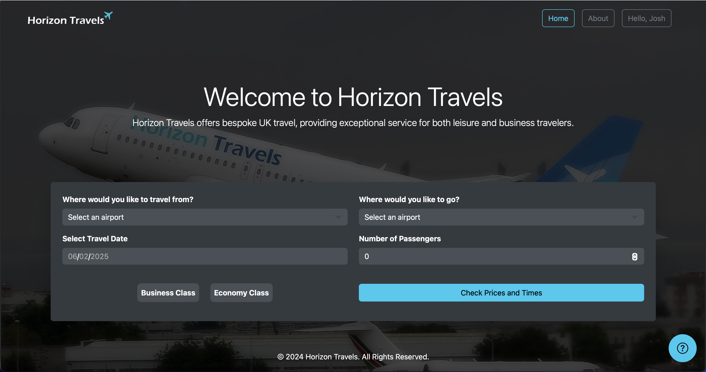
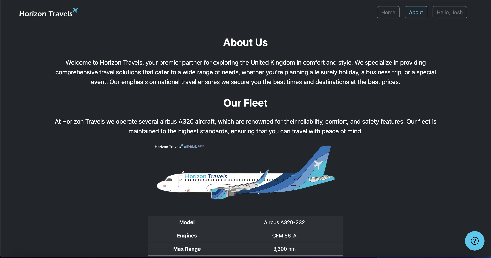

# HorizonTravels Web Development Year 1

Git repository for my **Year 1 Web Development Project** – *Horizon Travels* 
This project is a **flight booking system** built using Flask, with features like user authentication, flight booking, payment processing, and admin management.

---


## ❌ Academic Integrity Notice ❌ 

⚠️ Important Notice ⚠️

This project is provided strictly for reference and learning purposes only.
You are not allowed to:
#### • Submit this project as your own work for any academic assignments.	
####	• Reproduce, distribute, or reuse this code for academic purposes.

Any unauthorized use of this project for academic submissions violates university policies and ethical standards.
Please use this repository only for learning and improving your skills.


## 📜 License

This project is not licensed for redistribution or academic use. Feel free to explore and learn from the code, but do not submit it as coursework.

## 🚀 Features
- **User Authentication**: Secure login and registration system with session
- **Flight Booking**: Browse and book flights with ease
- **Boarding Pass Generator**: Downloadable PDF boarding passes with QR codes
- **Admin Management**: Manage users, flights, and bookings
- **Modern UI**: Dark theme with a responsive design
- **Smart Notifications**: Uses modals instead of flash messages for a seamless experience

---

## 🛠️ Tech Stack
- **Backend**: Flask (Python)
- **Frontend**: HTML, CSS, JavaScript
- **Database**: MySQL
- **PDF Generation**: ReportLab
- **QR Code Integration**: qrcode library

---

## 📸 Screenshots

### 🏠 Home Page


### 🔑 User Login


### 👤 My Account Page


### 🔒 Admin Login


### ⚙️ Admin Panel


### 📜 About Page


### 💺 Seat Map and Contact Card


### 📱 Tablet View


---

##  Installation & Setup
### 1️ Clone the Repository
```sh
git clone https://github.com/YOUR-USERNAME/HorizonTravels-webyear1.git
cd HorizonTravels-webyear1
```

### 2 Install requirements
```sh
Windows : pip install -r requirements.txt
Mac : pip3 install -r requirements.txt
```

### 3 Set up database 
    1.  Create a MySQL database.
	2.	Import the provided .sql file.
	3.	Update db_config.py with your database credentials.

### Run app 
```sh
cd directory/you/cloned/to
Windows: python app.py
Mac: python3 app.py
```
